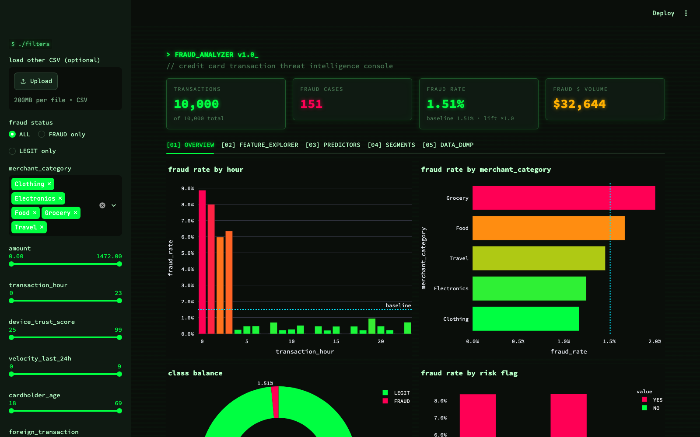
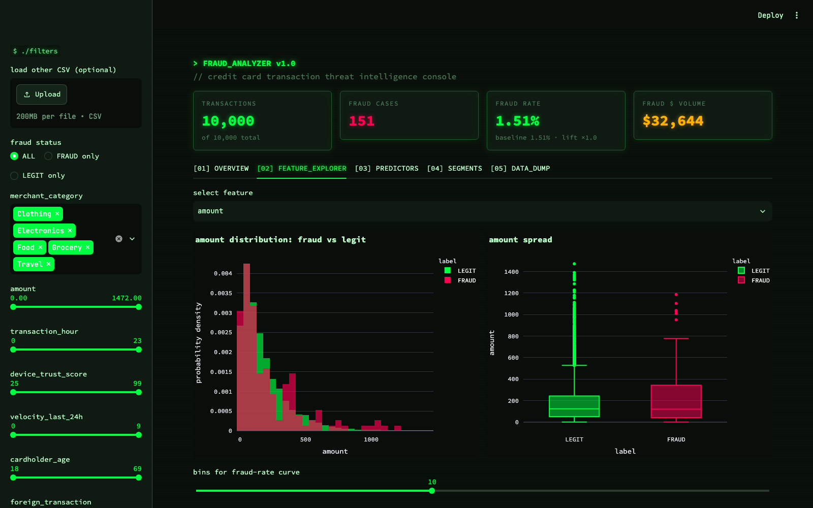
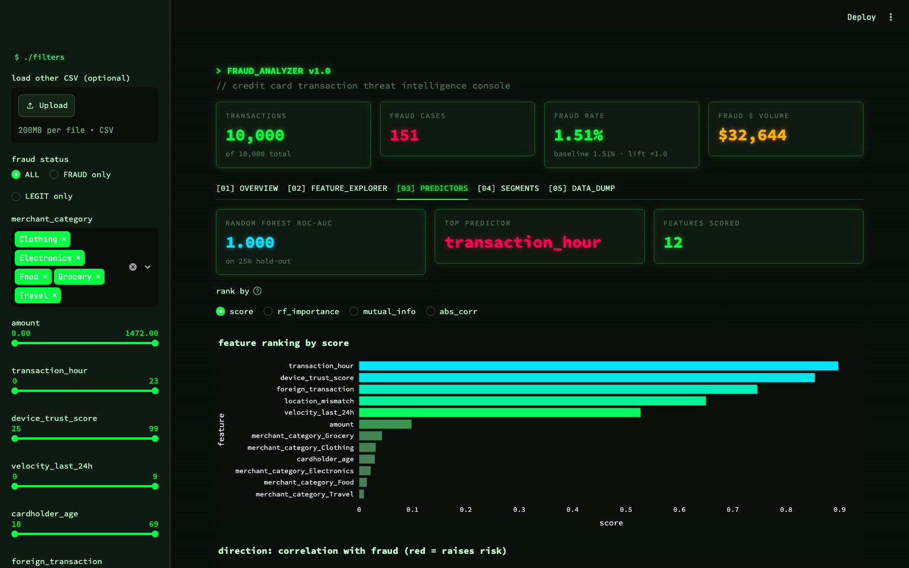
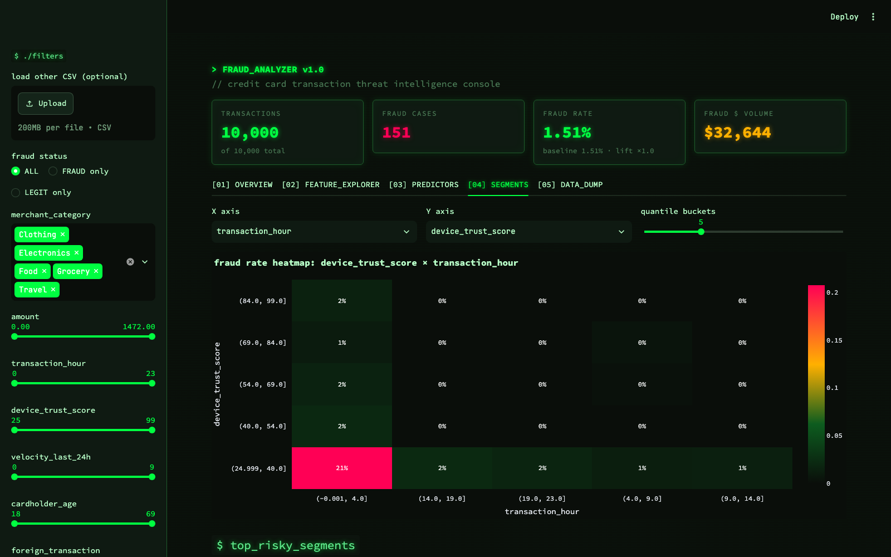
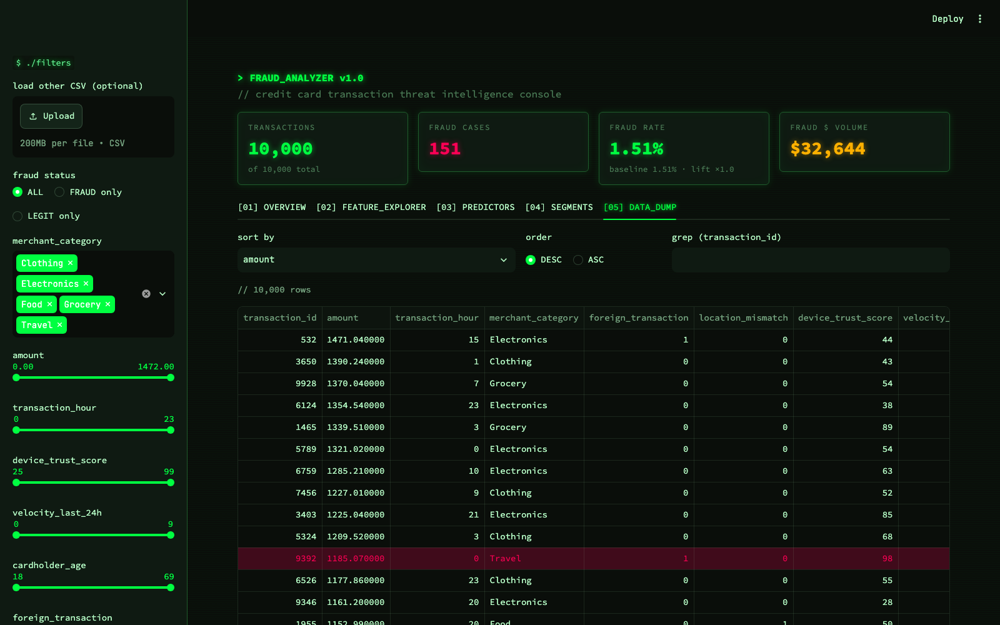

# FRAUD_ANALYZER

Hacker-themed Streamlit dashboard for exploring credit card fraud data and finding the features that predict fraud.

## Screenshots

### Overview


### Feature Explorer


### Predictors


### Segments


### Data Table


## Run locally

```bash
python3 -m venv .venv && source .venv/bin/activate
pip install -r requirements.txt
streamlit run app.py
```

Tabs: Overview · Feature Explorer · Predictors (correlation / mutual info / RandomForest) · Segments (fraud-rate heatmaps, risky segments) · Data table with sort & CSV export.
